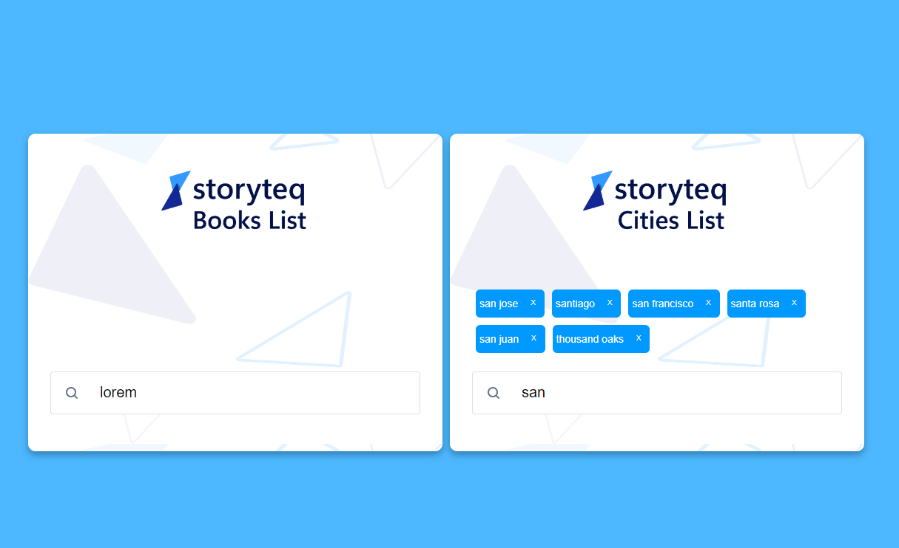

# storyteq-task
- 
- 
## Project setup
```
npm install
```
### Compile and Hot-Reload for Development
```
npm run dev

```

### Run Unit Tests with Vitest
```
npm run test:unit
```

### build the project with vite
```
npm run build
```

### Lint with ESLint
```
npm run lint
```


### Checklist √
- [x] README.md contain sufficient information to run the project
- [x] It works
- [x] Component based ( for a small project it's a bit difficult to divide component )
- [x] Clean code
- [x] End result meet UI/UX guidelines for the end user both mobile and desktop ( can be improved by implementing screenreaders support )

#### Autocomplete challenge

- [x] Use Vue.js
- [x] Provide a README file and add information on how to build and/or run the project locally
- [x] Push the application to a public github repo and provide us with a link.
- [x] Do not cheat.
- [x] Capture key presses from a text input and use the current value of the input to match items in the list
- [x] The application should output the results under the input field as soon as you type at least 3 characters.
- [x] If you type less than 3 characters in the text field, it should not output any results. (It can show a prompt to type at least 3 characters)
- [x] If there are no results for the search, you should let the user know.
- [x] When the page loads the search field should be selected automatically, so you can start typing (similar to when you go to https://www.google.com/)
- [x] Use some type of data store to store the results that your components will consume.
- [x] You can use any approach for getting the store state into your components. The important part is that you use one or more stores to store your datasets and query results.
- [x] There should be two autocompletes on the final page, one for the cities and one for books. The books autocomplete should show primarily the book title and secondarily the author for every matched result.
- [x] Include at least three unit tests. You can select the units of code to test based on what you find most important. You are free to use any testing framework of choice.
- [x] For the cities autocomplete, search through this list for approximate matches. For example, if the user enters san, it should match san, santiago, san francisco, santa rosa, etc. If they enter sant, it should only match santiago and santa rosa.
- [x] For the books autocomplete, search through the list of book.titles. For example, if the user enters don it should show a suggestion for 'Don Quixote'.


### Customize configuration
See [Configuration Reference](https://cli.vuejs.org/config/).
